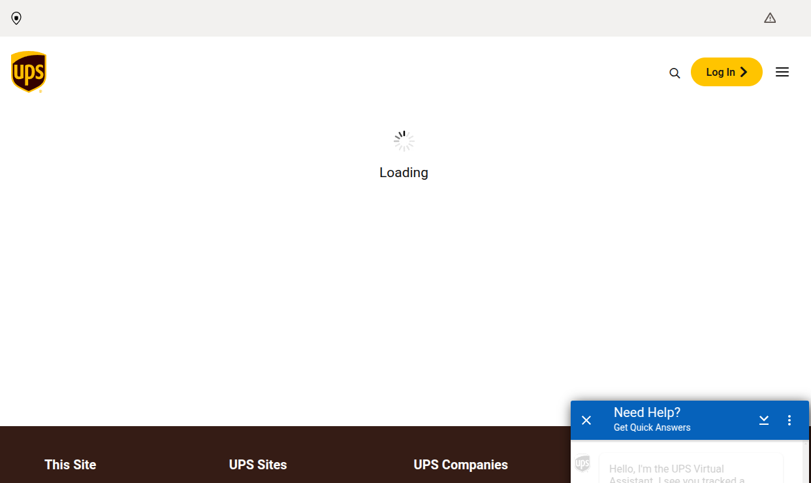
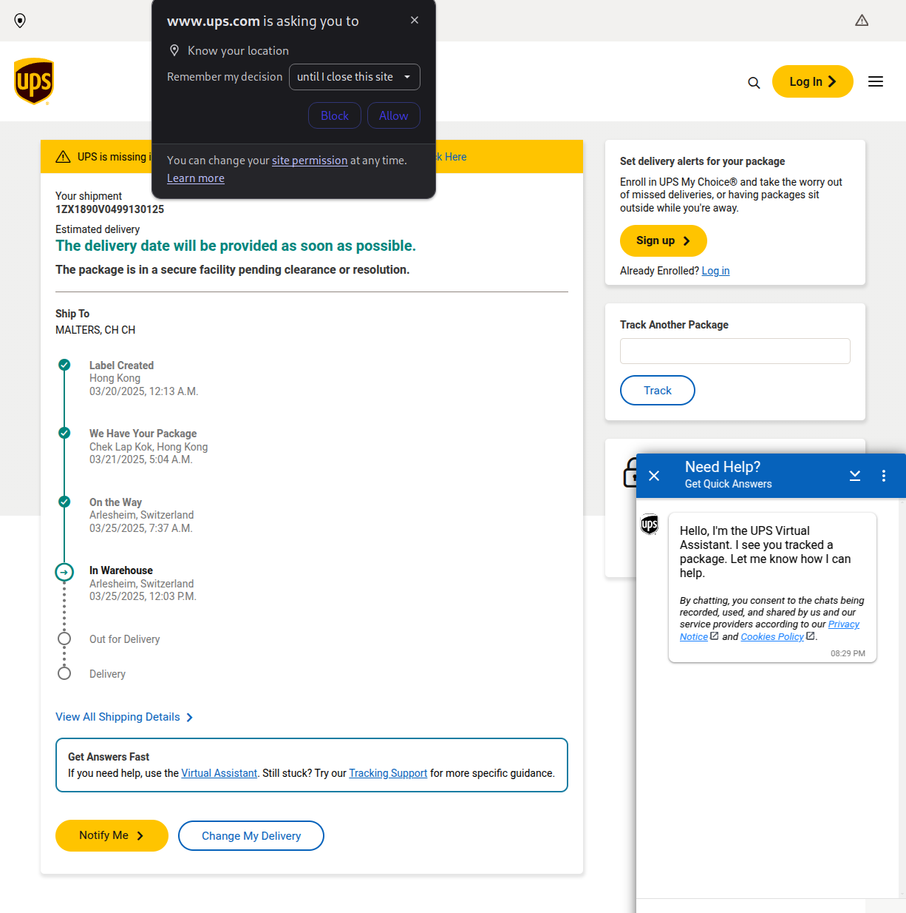
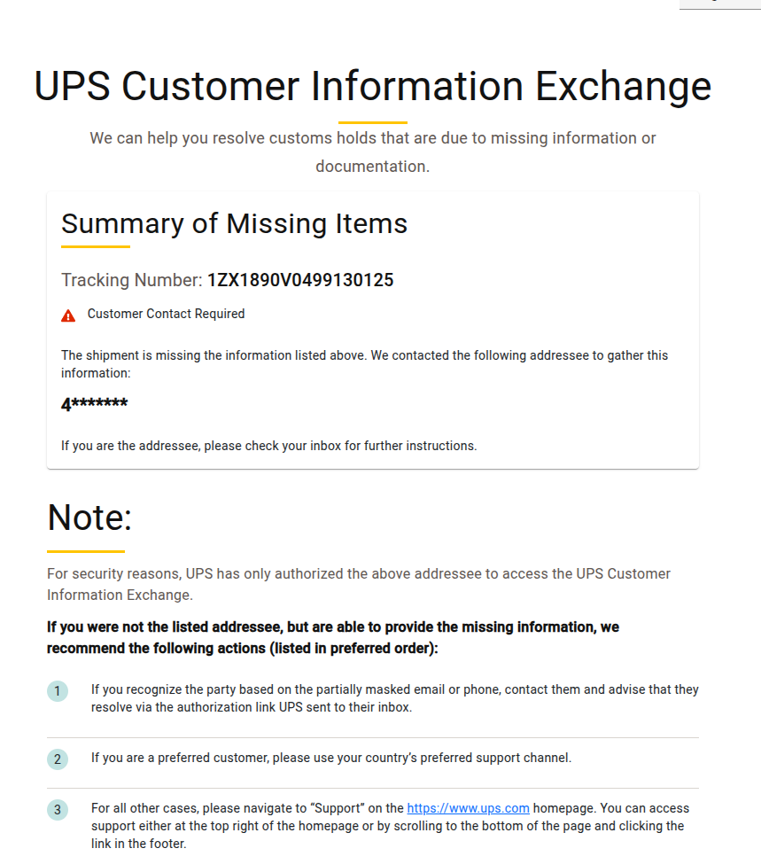
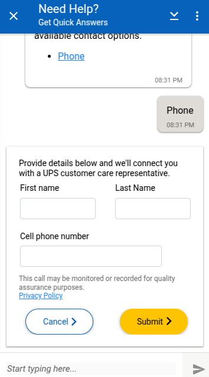
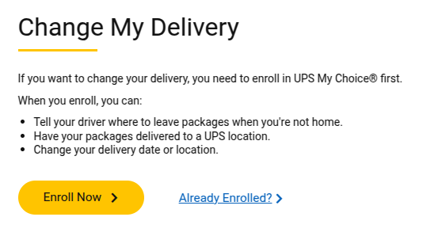

+++ 
draft = false
date = 2025-03-25T20:52:31+01:00
title = "YAPASI"
description = "Yet another post about the state of the internet"
slug = "state-of-the-internet"
authors = ["Christian Lohr"]
tags = ["internet", "personal"]
categories = ["internet", "personal"]
externalLink = ""
series = []
+++

I know, I know. The web is filled with complaints about this, especially in the tech community. And yet, large companies with Frankenstein monsters of decades old legacy systems, desperately facelifted using some modern CSS, continue on the path to absolute stagnation.

And of course I get why. Migrating large, globally distributed legacy systems built on mainframe technology in industries with zero downtime constraints and constantly cranking international data pipeline to keep the well oiled machine running is simply not an option. But have you tried booking a flight, a hotel or a rental car any time lately? 

Chances are you have, and might therefore have a slight premonition of what I'm about to unload here. Good. I urge you to close this page, preserve your mental sanity and go frolicking somewhere else. For the rest of you, let's take a look at what the UPS shipment tracking experience offers in the year 2025.

Upon clicking the shipment tracking link, a page in corporate branding opens up and we're being greeted by one of many, many loading spinners. Personally, I love how the AI chat box is already present though. Nice focus on the important bits.

After a couple more seconds, the spinner finally gives way to our tracking information. This, **this right here** is the only time I can at least understand why there needs to be a spinner involved. What I cannot understand however, is why it would need to know my location for this simple query (yes, I can guess why).

I can see that there is some customs information missing on the shipment, luckily UPS has blessed us with a link allowing us to supply additional information. Clicking this link on my phone does ... absolutely nothing. Even after disabling my ad blocker and reducing content blocking.

Alas, on the desktop, and **only** when using a Chromium backed browser, we're finally able to click the link. A new window opens and draws us further into this magical new world, tickles our imagination and makes us wonder what could possibly be behind this link. It's another spinner.

This one spins for about 5 seconds, then the page is hydrated and displayed. But only for about half a second. Then, the spinner is back. For another few seconds. Why? Don't know. Maybe it forgot something. Maybe it's just shy. Who knows.

Anyway, after plenty of spinning, UPS is kind enough to share with me the following information:

> We can help to resolve customs holds that are due to missing information or documentation.

Great! That's exactly what I need. Now all I need to do is ... hold on. What? They have contacted who? Who is `4*******`? My email doesn't start with `4`. My phone number doesn't start with `4`. My name doesn't start with `4`. What is this? Why is this? Who is this? What is going on?

Frantically I check all my inboxes. Email. Text messages. Signal. WhatsApp. Telegram. Nothing. No contact from UPS. No contact from `4*******`. No contact from anyone. 

There is of course no other way to supply the needed information. No form. No email. No phone number. No chat. No carrier pigeon. No smoke signals. No Morse code. No nothing. Just a cryptic message on a website that is already a labyrinth of spinning wheels and dead ends.

But then I remember the chat box! The AI might be able to help. With a triumphal laugh, I start messaging. Shortly after, my smile turns into a frown when I realise that despite the AI bull run of the past few years, there is only a very basic chat bot behind the box.

After some meaningless back and forth I am finally given the option of getting a call. Annoyed, I enter my name and number, hit the submit button - and the form crashes. Nothing happens. A single tear slowly wanders down my cheek.

I resign. As a last resort, I decide to attempt using the *Change Delivery* option, thinking maybe I can supply my full address that way. And for the first time in my life, I was forced to create a new account for such a basic interaction. **I can change my airline booking using my last name and booking reference**, but that is of course child's play compared to updating my shipping information. For a sophisticated undertaking like this, we will need the helpful services of *UPS My Choice®*.

I am very, very annoyed at this point. But I am also very, very curious. So I hit the link to create a new account. Can you guess what happens next? 

---

If you're still with me, thank you for reading. You deserve a short video documentation of the experience. I hope you enjoy it. If you are working or have ever worked with UPS, or you know of someone who has, I would **love** to hear your thoughts on this. Reach out over at [Mastodon](https://mastodon.social/@clohr) or [via email](mailto:cl@bytewerk.io).


